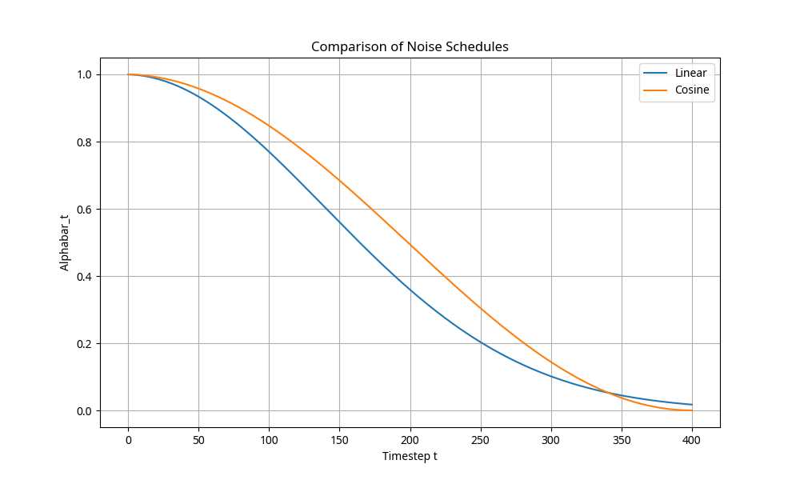
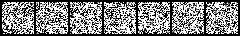
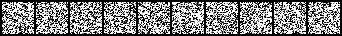
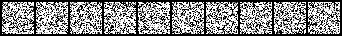
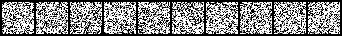
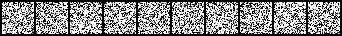

# Denoising Diffusion Probabilistic Model (DDPM) for MNIST Digit Generation

## Project Overview
This project implements a Denoising Diffusion Probabilistic Model (DDPM) to generate high-quality handwritten digits from the MNIST dataset. Diffusion models represent a powerful class of generative models that learn to reverse a gradual noise-adding process, enabling the synthesis of novel data samples from pure noise.

## Key Features
- **Contextual U-Net Architecture**: Utilizes a U-Net based neural network with residual blocks, downsampling, and upsampling layers to effectively capture multi-scale features and predict noise.
- **Time and Class Conditioning**: Incorporates time and class embeddings to guide the generation process, allowing for the synthesis of specific digit classes (0-9).
- **Classifier-Free Guidance**: Enhances the quality and class-specificity of generated samples by leveraging both conditional and unconditional noise predictions.
- **Flexible Noise Schedules**: Supports both linear and cosine noise schedules for the forward diffusion process, with comparative analysis of their impact on generation quality.
- **Accelerated Sampling with DDIM**: Implements the Denoising Diffusion Implicit Model (DDIM) for faster inference, enabling high-quality sample generation with significantly fewer steps.

## Implementation Details

### Model Architecture
The core of the generative model is a **Contextual U-Net**. This architecture is designed to predict the noise component added to an image at a given timestep. It includes:
- **Residual Blocks**: For stable training and improved gradient flow.
- **Downsampling and Upsampling Layers**: To capture features at different scales.
- **Time and Context Embeddings**: To condition generation on timestep and digit class.
- **Classifier-Free Guidance**: To improve generation quality and class alignment.

### Diffusion Process
- **Forward Process**: Gradual addition of Gaussian noise to data samples.
- **Reverse Process**: Model learns to denoise images iteratively, reconstructing data from noise.

### Noise Schedules
- **Linear Schedule**: Standard noise schedule where variance increases linearly.
- **Cosine Schedule**: Provides a smoother noise increase, often leading to superior generation quality.

### Accelerated Sampling (DDIM)
DDIM enables faster generation by skipping timesteps, allowing for high-quality sampling in fewer steps.

## Experimental Results

### Noise Schedule Comparison
Comparison of linear and cosine schedules for the cumulative product of alphas ($\bar{\alpha}_t$):



The **Cosine schedule** generally preserves more information in early timesteps, leading to better perceptual quality in generated images due to its gradual noise degradation.

### Generated Digits
Example of generated handwritten digits:



This image demonstrates the model's ability to produce clear and recognizable digits, conditioned on specific class labels.

### DDPM vs. DDIM Sampling Comparison

Visual comparison of DDPM (full steps) and DDIM sampling with varying step counts:

**DDPM Full Sample (50 steps):**


**DDIM Sample (50 steps):**


**DDIM Sample (20 steps):**


**DDIM Sample (10 steps):**


**Analysis:**
- The **cosine schedule** generally produces sharper and more coherent digits due to better preservation of signal information.
- DDIM sample quality **decreases** as the number of steps is reduced. While 50 and 20 steps yield good results, 10 steps show noticeable degradation.
- Quality becomes **noticeably worse** at 10 steps or fewer, indicating a trade-off between sampling speed and image fidelity.

## Getting Started

### Prerequisites
- Python 3.x
- PyTorch
- torchvision
- matplotlib
- numpy
- tqdm

### Installation
```bash
pip install torch torchvision matplotlib numpy tqdm
```

### Usage
To train the model and generate samples, run the main Python script:
```bash
python diffusion_model.py
```

Alternatively, you can explore the `diffusion_model_notebook.ipynb` for an interactive experience and step-by-step execution.

## License
This project is licensed under the MIT License.
